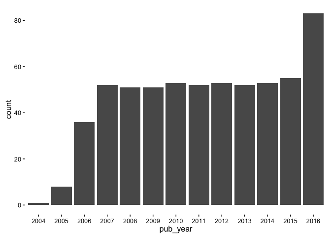

# New York Times API and httr
Connor Gilroy  
`r Sys.Date()`  

## Outline

- Introduce `httr`
- Introduce NYT Article Search API
- Construct a request
- Look at the response
- (Bonus: extract data from multiple responses, clean, and save to csv)

## Packages used


```r
library(httr)
library(yaml)
library(jsonlite)
library(dplyr)
```

## The `httr` package

`httr` methods map to HTTP verbs like GET and POST. 

The [quickstart guide](https://cran.r-project.org/web/packages/httr/vignettes/quickstart.html) for `httr` is very useful. 

`httr` is very similar to the `requests` package in Python. 

## The New York Times API

http://developer.nytimes.com/

Requires an API key; signup is straightforward. 

The NYT maintains several APIs. The one I'm demoing is the Article Search API. See here for documentation: http://developer.nytimes.com/article_search_v2.json

## Why not use a dedicated package?

There are dedicated R and Python packages that serve as wrappers for the NYT API--- [`rtimes`](https://cran.r-project.org/web/packages/rtimes/index.html) for R and [`nytimesarticle`](https://pypi.python.org/pypi/nytimesarticle/0.1.0) for Python. 

But learning a more generic http requests package translates to other APIs, not just the New York Times, and you aren't relying on the wrapper package being maintained if something about the NYT API changes. You can just read the NYT documentation and update your requests yourself.  

## Load API key and base url for requests

I prefer to store my API keys in a YAML config file. I add that file to .gitignore to avoid committing it to GitHub.


```r
nyt_api <- yaml.load_file("nyt_api.yml")
nyt_articlesearch_url <- 
  "https://api.nytimes.com/svc/search/v2/articlesearch.json"
```

(YAML is like JSON or XML but more readable.)

## Query parameters

`httr` will stick these at the end of your request so that it looks like this:

```
http://www.example.com/something?querykey1=value1&querykey2=value2
```


```r
query_list <- 
  list(
    `api-key` = nyt_api$article_search_api_key, 
    fq = "kicker:(%22Modern Love%22)"
  )
```

"Modern Love" is surrounded by quotation marks; for whatever reason this works best when the quotation marks are [percent-encoded](https://en.wikipedia.org/wiki/Percent-encoding) manually. The parentheses also wind up percent-encoded in the end, so don't ask me why...

## Make a request


```r
r <- GET(nyt_articlesearch_url, query = query_list)
```

## Check out the response


```r
status_code(r)
```

```
## [1] 200
```

```r
content(r)$response$meta
```

```
## $hits
## [1] 613
## 
## $time
## [1] 26
## 
## $offset
## [1] 0
```

```r
docs <- content(r)$response$docs
```

----


```
## List of 20
##  $ web_url          : chr "http://www.nytimes.com/2016/11/06/fashion/modern-love-children-cuddling-physical-intimacy.html"
##  $ snippet          : chr "When her only child outgrows cuddling, a single mother realizes that her daily life is almost entirely without physical affecti"| __truncated__
##  $ lead_paragraph   : chr "When her only child outgrows cuddling, a single mother realizes that her daily life is almost entirely without physical affecti"| __truncated__
##  $ abstract         : NULL
##  $ print_page       : chr "8"
##  $ blog             : list()
##  $ source           : chr "The New York Times"
##  $ multimedia       :List of 3
##   ..$ :List of 6
##   .. ..$ width  : int 190
##   .. ..$ url    : chr "images/2016/11/04/fashion/06MODERN/06MODERN-thumbWide-v2.jpg"
##   .. ..$ height : int 126
##   .. ..$ subtype: chr "wide"
##   .. ..$ legacy :List of 3
##   .. .. ..$ wide      : chr "images/2016/11/04/fashion/06MODERN/06MODERN-thumbWide-v2.jpg"
##   .. .. ..$ wideheight: chr "126"
##   .. .. ..$ widewidth : chr "190"
##   .. ..$ type   : chr "image"
##   ..$ :List of 6
##   .. ..$ width  : int 600
##   .. ..$ url    : chr "images/2016/11/04/fashion/06MODERN/06MODERN-articleLarge.jpg"
##   .. ..$ height : int 746
##   .. ..$ subtype: chr "xlarge"
##   .. ..$ legacy :List of 3
##   .. .. ..$ xlargewidth : chr "600"
##   .. .. ..$ xlarge      : chr "images/2016/11/04/fashion/06MODERN/06MODERN-articleLarge.jpg"
##   .. .. ..$ xlargeheight: chr "746"
##   .. ..$ type   : chr "image"
##   ..$ :List of 6
##   .. ..$ width  : int 75
##   .. ..$ url    : chr "images/2016/11/04/fashion/06MODERN/06MODERN-thumbStandard.jpg"
##   .. ..$ height : int 75
##   .. ..$ subtype: chr "thumbnail"
##   .. ..$ legacy :List of 3
##   .. .. ..$ thumbnailheight: chr "75"
##   .. .. ..$ thumbnail      : chr "images/2016/11/04/fashion/06MODERN/06MODERN-thumbStandard.jpg"
##   .. .. ..$ thumbnailwidth : chr "75"
##   .. ..$ type   : chr "image"
##  $ headline         :List of 4
##   ..$ main          : chr "My U-Turn From Isolation to Intimacy"
##   ..$ content_kicker: chr "Modern Love"
##   ..$ kicker        : chr "Modern Love"
##   ..$ print_headline: chr "My U-Turn From Isolation to Intimacy"
##  $ keywords         :List of 3
##   ..$ :List of 4
##   .. ..$ rank    : chr "1"
##   .. ..$ is_major: chr "N"
##   .. ..$ name    : chr "subject"
##   .. ..$ value   : chr "Dating and Relationships"
##   ..$ :List of 4
##   .. ..$ rank    : chr "2"
##   .. ..$ is_major: chr "N"
##   .. ..$ name    : chr "subject"
##   .. ..$ value   : chr "Single Persons"
##   ..$ :List of 4
##   .. ..$ rank    : chr "3"
##   .. ..$ is_major: chr "N"
##   .. ..$ name    : chr "glocations"
##   .. ..$ value   : chr "Los Angeles (Calif)"
##  $ pub_date         : chr "2016-11-04T09:00:08Z"
##  $ document_type    : chr "article"
##  $ news_desk        : chr "Styles"
##  $ section_name     : chr "Fashion & Style"
##  $ subsection_name  : NULL
##  $ byline           :List of 2
##   ..$ person  :List of 1
##   .. ..$ :List of 5
##   .. .. ..$ organization: chr ""
##   .. .. ..$ role        : chr "reported"
##   .. .. ..$ firstname   : chr "Michelle"
##   .. .. ..$ rank        : int 1
##   .. .. ..$ lastname    : chr "FIORDALISO"
##   ..$ original: chr "By MICHELLE FIORDALISO"
##  $ type_of_material : chr "News"
##  $ _id              : chr "581c4e1c7c459f6a5fccc2f8"
##  $ word_count       : chr "1494"
##  $ slideshow_credits: NULL
```

## Create data frame with desired fields


```r
modern_love_from_api <- 
    lapply(docs, function(x) {
    data_frame(pub_date = x$pub_date, 
               title = x$headline$main,
               author = x$byline$original,
               snippet = x$snippet,
               web_url = x$web_url)
    }) %>% bind_rows()
```

----


```r
modern_love_from_api$title
```

```
##  [1] "My U-Turn From Isolation to Intimacy"                                                            
##  [2] "The Modern Love Podcast: Issa Rae Reads ‘Even in Real Life, There Were Screens Between Us’"      
##  [3] "My Biological Clock Can’t Tick Fast Enough"                                                      
##  [4] "The Modern Love Podcast: Live From New York"                                                     
##  [5] "Cropped Out of My Own Fantasy"                                                                   
##  [6] "The Modern Love Podcast: Rebecca Hall Reads ‘Take Me as I Am, Whoever I Am’"                     
##  [7] "What’s Love? Don’t Ask the Answer Couple"                                                        
##  [8] "The Modern Love Podcast: Constance Wu Reads ‘Marry a Man Who Loves His Mother’"                  
##  [9] "When Trump vs. Clinton Becomes a Family Affair"                                                  
## [10] "The Modern Love Podcast: Dash Mihok Reads ‘A Path to Fatherhood, With (Shared) Morning Sickness’"
```

----


```r
modern_love_from_api$snippet
```

```
##  [1] "When her only child outgrows cuddling, a single mother realizes that her daily life is almost entirely without physical affection, or even touch, from anyone."                                  
##  [2] "The “Insecure” actress reads the story of a long-distance couple who grew so close online that they decided to see if it would work in real life."                                               
##  [3] "A woman with no maternal desire wrestles with the expectation that married couples should try to have children."                                                                                 
##  [4] "On this week’s podcast, Issa Rae (of the web series “Awkward Black Girl”) reads the story of a long-distance couple who grow so close on screen they decide to see if it will work in real life."
##  [5] "A young woman relies on carefully prepared images to present her relationship in the best light, until the picture no longer includes her."                                                      
##  [6] "The star of the new movie “Christine” reads the essay of a woman whose romantic life seesaws from bold flirtation to fearful withdrawal."                                                        
##  [7] "A onetime advice columnist realizes that the more she learns about love, the less she seems to know."                                                                                            
##  [8] "The “Fresh Off the Boat” actress reads the story of a new bride, her judgmental mother-in-law and the husband (and son) who’s caught between them and a war."                                    
##  [9] "In midlife, a man quickly forges a tight bond with a sister he never knew he had, until the presidential campaign threatens to pull them apart."                                                 
## [10] "On this week’s Modern Love podcast, the “Ray Donovan” actor reads a story of a husband who experiences his wife’s pregancy more acutely than most."
```

## Pages

Each "page" of the response returns 10 articles (`content(r)$response$docs`). You can request a specific page as part of the query. 


```r
## make sure I got the right number of hits
hits <- content(r)$response$meta$hits
hits
```

```
## [1] 613
```

```r
## 613 hits, but only 10 per "page"
pages <- 0:(ceiling(hits/10) - 1)
```

## Bonus: get all the pages

Note the use of `Sys.sleep()` to avoid being rate-limited. (5 seconds per call is probably overkill; the [actual limit](http://developer.nytimes.com/faq#12) is 5 calls per second, max 1000 per day.)


```r
requests <- 
  lapply(pages, function(x, query_list) {
    new_query_list <- c(query_list, page = x)
    ## wait to avoid being rate-limited
    Sys.sleep(5)
    r <- GET(nyt_articlesearch_url, query = new_query_list)
  }, query_list = query_list)
```


## Additional packages for tidying data


```r
library(readr)
library(ggplot2)
library(stringr)
```

## Save responses in JSON format

Not run: write each valid response to a separate json file.


```r
Map(function(r, x) {
  ## build file name
  file_name <- str_c("modern_love", str_pad(as.character(x), 2, pad = "0"), 
                     sep = "_") %>%
    str_c(".json") %>%
    file.path("data", .)
  ## write to file as JSON
  if (status_code(r) == 200) {
    content(r) %>% toJSON() %>% prettify() %>% write_file(file_name)
  }
}, r = requests, x = pages) %>% invisible()
```

## Create data frame with desired fields

One request returned a Status 403; filter that response out.


```r
## filter out Status 403 (page 59 from 0 to 60)
status_code(requests[[60]])
```

```
## [1] 403
```

```r
requests_ok <- requests[lapply(requests, status_code) == 200]
```

## Create data frame with desired fields

Note the special handling for the author field, discovered by trial and error. One interactive article didn't have a byline.


```r
## create data frame
modern_love_from_api <- 
  lapply(requests_ok, function(r) {
    content(r)$response$docs %>%
      lapply(function(x) {
        ## special handling for one interactive feature with a null byline
        ## "Try the 36 Questions on the Way to Love" on 2015-02-13
        author <- if(length(x$byline) > 0) x$byline$original else NA
        data_frame(pub_date = x$pub_date, 
                   title = x$headline$main,
                   author = author,
                   snippet = x$snippet,
                   web_url = x$web_url)
      }) %>% bind_rows()
  }) %>% bind_rows()
```

## Clean data format and byline


```r
modern_love_cleaned <- 
  modern_love_from_api %>%
  mutate(pub_date = as.Date(pub_date, format = "%Y-%m-%d"), 
         author = str_replace(author, "^By ", ""))
```

## Check out number of articles per year

<!-- -->

## Save data frame to csv

Split columns and podcasts into separate csv files.

`readr` has a dedicated function for writing csv files so that Excel can interpret the encoding of non-ASCII characters correctly. 


```r
## simplest way to disambiguate podcasts from regular columns
modern_love_columns <- 
  modern_love_cleaned %>%
  filter(author != "THE NEW YORK TIMES")

modern_love_podcasts <- 
  modern_love_cleaned %>%
  filter(author == "THE NEW YORK TIMES")

## Signal UTF-8 encoding to Excel with `write_excel_csv()`
write_excel_csv(modern_love_columns, "data/modern_love_columns.csv")
write_excel_csv(modern_love_podcasts, "data/modern_love_podcasts.csv")
```
